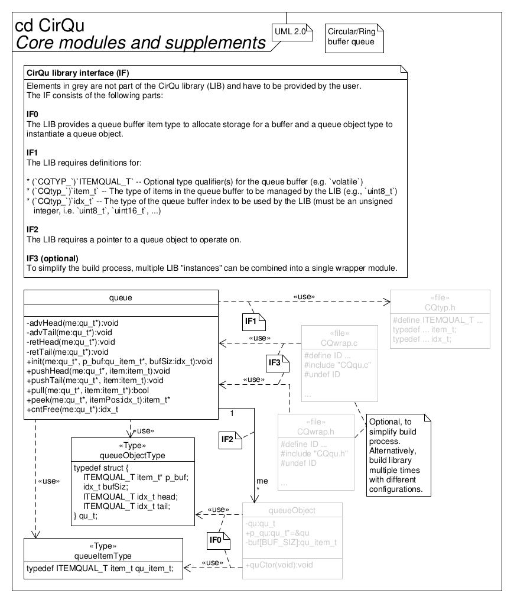

# CirQu - Simple circular queue library

This library employs a simple and tiny

*circular/ring/FIFO/LIFO buffer/queue*

to manage elements in a storage.

## Requirements specification

The following loosely lists requirements, constraints, features and goals.

* Circular/ring/FIFO/LIFO buffering/queueing management of multiple elements
  within a storage in embedded systems for real-time applications
* Element type can be chosen at compile time
* A new element can be pushed into the queue at its head or tail and the next
  element can be pulled from the tail of the queue
* Each stored element in the queue can be peeked at (i.e. accessed through
  pointer without removal) by its relative index starting from the tail
  position
* The buffer can be queried about its count of available free element slots
* Queue size can be configured at buffer object instantiation by linking
  allocated memory (storage) to it
* Lock-free access possible (with only one producer and consumer if the queue
  never overflows, that is, if `pushHead`/`pushTail` is never issued on a full
  queue
* API (public function) names automatically adjust to element type via
  preprocessor macro to enable the use of multiple queues with different sizes
  within a project without name conflicts

* Library design
* Deployment in embedded systems
* Code implementation in the C programming language ("C99", ISO/IEC 9899:1999)
* Interfaces with the application software through element storage arrays

* Low impact on technical budgets
    * Low CPU utilization
    * Small memory footprint in ROM (text, data) and RAM (data, heap, stack)
    * Runs (also) well on "small" MCUs (e.g., AVR ATmega328P/Arduino Uno)
* Quality model
    * "Simple" (low complexity of software architecture and detailed design,
      essential features only)
    * Modular
    * Re-usable
    * Portable
    * No unused ("dead") code: optional functionality in seperate translation
      units (so it can be excluded by the linker) or conditionally included via
      preprocessor defines
    * Unit tested with 100 % coverage (LOC executed, branches taken, functions
      called)
    * Defined quality metrics (see table below)
    * MISRA-C:2012 compliant
    * Static code analysis pass
    * No dynamic memory allocation (via `malloc()` or similar)
    * SCM via Git with semantic versioning
* Well documented (from requirements over architecture to detailed design),
  using Doxygen, Markdown, custom diagrams, UML
* Traceability from requirements specification to implementation by
  transitivity

Quality metrics:

| Metric                                       | Target   |
| -------------------------------------------- | -------- |
| No. of parameters/arguments (per func.)      | \<= 6    |
| No. of instructions (per func.)              | \<= 100  |
| No. of nested control structures (per func.) | \<= 5    |
| Cyclomatic complexity number (per func.)     | \<= 10   |
| Comment rate (per file)                      | \>= 20 % |
| Unit test (decision) coverage                | = 100 %  |

## Architecture

