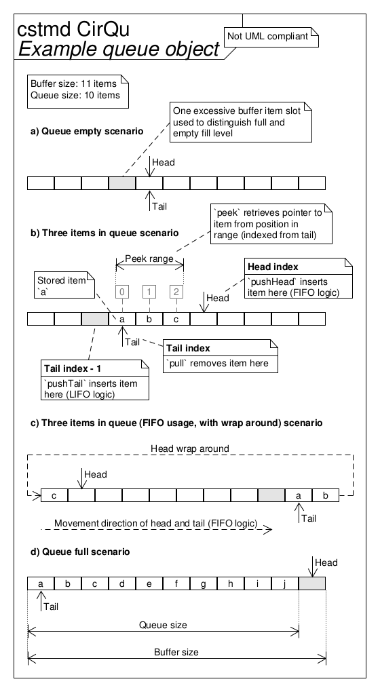
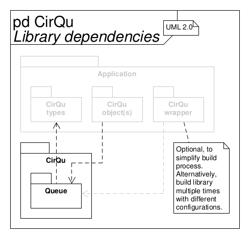

<!--
Keywords:
buffer, circular, embedded, embedded-systems, fifo, library, lifo, queue, ring,
template
-->

# CirQu - Simple circular queue library

This library employs a simple and tiny

*circular/ring/FIFO/LIFO buffer/queue*

to manage items in a storage.

> Used terminology in this documentation:
>
> * Queue - Architectural concept to asynchronously storing produced data and
>   consuming it
> * Buffer - Detailed design component to arrange storage into items on which
>   the queue operates
> * Storage - The abstracted, physical memory managed by the buffer
> * Item - One of multiple items, handled by the queue (or storage units,
>   which constitute the buffer)

## Requirements specification

The following loosely lists requirements, constraints, features and goals.

* Circular/ring/FIFO/LIFO buffering/queueing management of multiple items
  within a storage in embedded systems for real-time applications
* Item type (and optional type qualifiers) can be chosen at compile time
* Library can be "instantiated" multiple times in one project (without name
  conflicts) for different item types via C++-like template imitation with
  preprocessor macros (facilitates type safety in contrast to `void*` usage)
* A new item can be pushed into the queue at its head or tail and the next
  item can be pulled from the tail of the queue
* Each stored item in the queue can be peeked at (i.e. accessed through
  pointer without removal) by its relative index starting from the tail
  position
* Queue can be queried about its count of available free buffer item slots
* Queue size can be configured at queue object instantiation/initialization by
  linking allocated memory (storage managed by a buffer) to it
* Lock-free access possible (with only one producer and consumer) if the queue
  never overflows, that is, if `pushHead`/`pushTail` is never issued on a full
  queue

<!-- Separator -->

* Library design
* Deployment in embedded systems
* Code implementation in the C programming language ("C99", ISO/IEC 9899:1999)
* Interfaces with the application software through item storage arrays

<!-- Separator -->

* Low impact on technical budgets
    * Low CPU utilization
    * Small memory footprint in ROM (text, data) and RAM (data, heap, stack)
    * Runs (also) well on "small" MCUs (e.g., AVR ATmega328P/Arduino Uno)
* Quality model
    * "Simple" (low complexity of software architecture and detailed design,
      essential features only)
    * Modular
    * Re-usable
    * Portable
    * Unit tested with 100 % coverage (LOC executed, branches taken, functions
      called)
    * Defined quality metrics (see table below)
    * MISRA C:2012 compliant
    * Static code analysis pass
    * No dynamic memory allocation (via `malloc()` or similar)
    * SCM via Git with [Semantic Versioning](https://semver.org)
* Well documented (from requirements over architecture to detailed design),
  using Doxygen, Markdown, custom diagrams, UML
* Traceability from requirements specification to implementation by
  transitivity

Quality metrics:

| Metric                                       | Target   |
| -------------------------------------------- | -------- |
| No. of parameters/arguments (per func.)      | \<= 6    |
| No. of instructions (per func.)              | \<= 60   |
| No. of nested control structures (per func.) | \<= 5    |
| Cyclomatic complexity number (per func.)     | \<= 10   |
| Comment rate (per file)                      | \>= 20 % |
| Unit test (decision) coverage                | = 100 %  |

## How to deploy

The library can be "instantiated" multiple times in one project for different
item types via C++-like template imitation.
In contrast to the alternative solution of using `void*` item types, this
facilitates type safety.
However, this comes with a slight increase in deployment complexity.

There are two options to deploy this library:

**Option A - Wrapper module with multiple library "instances"**

> The example application uses this option.

With this option, the library is not directly `#include`d and compiled but
instead wrapped in another module, which unites all library "instances" by
configuring and `#include`ing them.
It unconventionally requires to include implementation files in *exactly one
section* of the code as a tradeoff to keep the build process simple.

Below is a header and implementation file of such a wrapper module for an
example with two library "instances" with the suffix IDs `0` and `1`.
Of course, there can be more or less "instances" and the ID names can be
changed as well.

Header file:

```c
#ifndef CQWRAP_H
#define CQWRAP_H

/* CirQu lib. interface configured with ID */
#define CQTEMPLSEUP_ID 0
#include "CQqu.h"
#undef CQTEMPLSEUP_ID

/* CirQu lib. interface configured with ID */
#define CQTEMPLSEUP_ID 1
#include "CQqu.h"
#undef CQTEMPLSEUP_ID

#endif /* CQWRAP_H */
```

Implementation file:

```c
/* Implementation of CirQu lib. configured with ID */
#define CQTEMPLSEUP_ID 0
#include "CQqu.c"
#undef CQTEMPLSEUP_ID

/* Implementation of CirQu lib. configured with ID */
#define CQTEMPLSEUP_ID 1
#include "CQqu.c"
#undef CQTEMPLSEUP_ID
```

*Only* this wrapper module is then compiled and linked and its interface
included, e.g.:

```c
/* Wrapper module with multiple "instances" of CirQu lib. */
#include "CQwrap.h"
```

**Option B - Build library multiple times with different configurations**

> The unit tests use this option (as test coverage can only be measured this
> way).

With this option, the library is directly configured, `#include`d, compiled and
linked multiple times.
It unconventionally requires to wrap each interface inclusion in "external"
include guards (since the interface has none to allow multiple inclusions) and
to configure each interface beforehand.

Below is an example code snipped of such `#include`s for two library
"instances" with the suffix IDs `0` and `1`.
Of course, there can be more or less "instances" and the ID names can be
changed as well.

```c
/* CirQu lib. interface configured with ID */
#ifndef CQQU_H0
#define CQQU_H0
#define CQTEMPLSEUP_ID 0
#include "CQqu.h"
#undef CQTEMPLSEUP_ID
#endif /* CQQU_H0 */

/* CirQu lib. interface configured with ID */
#ifndef CQQU_H1
#define CQQU_H1
#define CQTEMPLSEUP_ID 1
#include "CQqu.h"
#undef CQTEMPLSEUP_ID
#endif /* CQQU_H1 */
```

Each library "instance" must then be compiled into a separate object file by
supplying the ID name to the compiler, e.g.:

```sh
$ gcc -DCQTEMPLSEUP_ID=0 ... -c -I... CQqu.c -o CQqu0.o
$ gcc -DCQTEMPLSEUP_ID=1 ... -c -I... CQqu.c -o CQqu1.o
```

And then all those library "instance" obejct files must be provided to the
linker when linking the application in which this library is used.

**API usage for option A and B**

To use a library "instance"’s API (e.g. function calls, variable
declaration/definition), the ID suffix must be appended, e.g. for ID `0`:

```c
CQqu_qu_t0 ...;

CQqu_init0(...);
```

## Architecture






## Coding Standard

### Applicable Guidelines

This project aims to adhere to the following guidelines (with exceptions):

* The Power of Ten - Rules for Developing Safety Critical Code (NASA/JPL; G. J.
  Holzmann)
* MISRA C:2012 - Guidelines for the use of the C language in critical systems

If necessary, deviations from the guidelines are allowed but must be justified
and documented by means of inline comments.

### Further Style Conventions

Furthermore, the style is only loosely defined:

New added code should use the same style (i.e. "look similar") as the already
existing code base.

Some remarks on the non-obvious points of this style convention:

* Files are divided into an "attributes" and "operations" section (just like
  classes in a UML class diagram)
* `#include`s are placed in a module’s implementation (`*.c`) file(s), except
  when they include header files external to the project (e.g. libc) or if a
  module already uses another project-internal API in its own API (in both
  exceptional cases those `#include`s are then placed in the module’s header
  file)
* Multiple instructions (ending with `;`) within a macro are enclosed in a
  `do {...} while (false)` loop
* The limit for line breaks is 80 characters (slight overshoots are acceptable
  if it increases readability and if used sparingly)
* Whitespace is inserted after control flow structure keywords (e.g.
  `if/for/while/switch/return (...)`)
* Comments
    * ... can be placed above one or multiple line(s) (code block), addressing
      all following line(s) until the next empty line or lesser indentation
      level
    * ... can be placed at the end of a line, addressing this line only
    * ... can be placed below a long line with one additional indentation level
      to address this one long line in a code block where a comment does not
      fit at the end of the line
* Far away closing brackets/keywords of control structures are commented to
  indicate to what they belong (e.g. `#endif /* MODULENAME_H */`)
* API functions/macros/variables ("globals") etc. are prefixed with their
  module’s (abbreviated) name + `_`;  
  if the project is intended to be included in another project (e.g. the
  project is a library or framework), the prefix also starts with up to 3
  characters that abbreviate the project name
* Private, file-scope (`static`) variables are prefixed with `pv_`
* Pointers are prefixed with `p_`
* Types are suffixed with `_t`
* In object-oriented code, the pointer argument to an object of a class’
  function is named `me`

## Workflow

This project uses a simple topic branch Git workflow.
The only permanently existing branches are "develop" (development status;
unstable) and "master" (release status; stable).
New development efforts are done in separate topic branches, which are then
merged into develop once ready.
For releases, the "develop" branch is then merged into "master".
Fast-forward merges are preferred, if possible.
